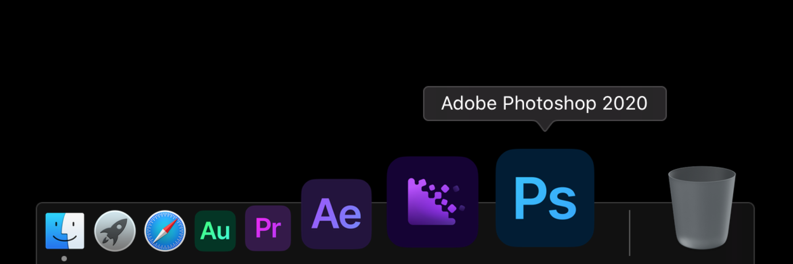

# Adobe 2020 Improved Icons

Да, я залил иконки на гит. Да, я написал readme.md на русском. 
Но... во1) че ты мне сделаешь вовторых2) крути педали втретих) что ты мне сделаешь, я в другом городе... за градиент извини.

В этом году Adobe *внезапно* сделали ребрендинг и убрали индивидуальный цвет у каждого приложения. Из-за этого отличать приложения друг от друга стало гораздо сложнее.

Поэтому, я сделал новые иконки, вернул индивидуальный цвет и *частично* классическую эстетику. Несмотря на это, мои иконки тоже не идеальны, поэтому, они будут обновляться, пополняться и улучшаться :-)
